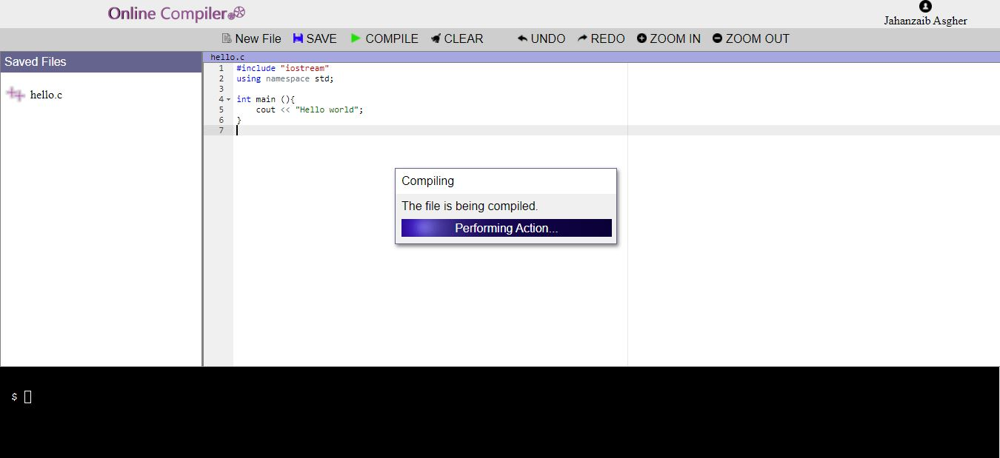

# **Online/Web Based Compiler**

This project was built for C++ web/browser based compiler with following features:

*   Compile and Run C++ program
*   Registered users can save files on server
*   Saved files can be managed, editted and re-compiled/run

Requirements for proper working:

*   PHP `exec` function enabled
*   G++ command line tool (Install MinGW Properly)
*   DB for managing users and files

 
Note: This project is just for education purposes and it should never be used in production because... you know, server security is the biggest issue!

## For database connections:
It is important to change credentials for the database. Just edit variables in `function.php` and you're good to go!
 Also remember to import the database from the given DB file `compiler.sql`

## Possible Errors:

*   `G++ not recognized`: Just check if you've installed MinGW properly and added the directory in the system `PATH`
*   `Classic DB Errors`: Just check if you've entered correct credentials in `function.php` file

 

I built this project a long time ago (in hurry)... Files were scattered, now I put them in single folder. If anyone worked (upgraded) this project just send a push request with proper folder structure.

 

**Do good things!**